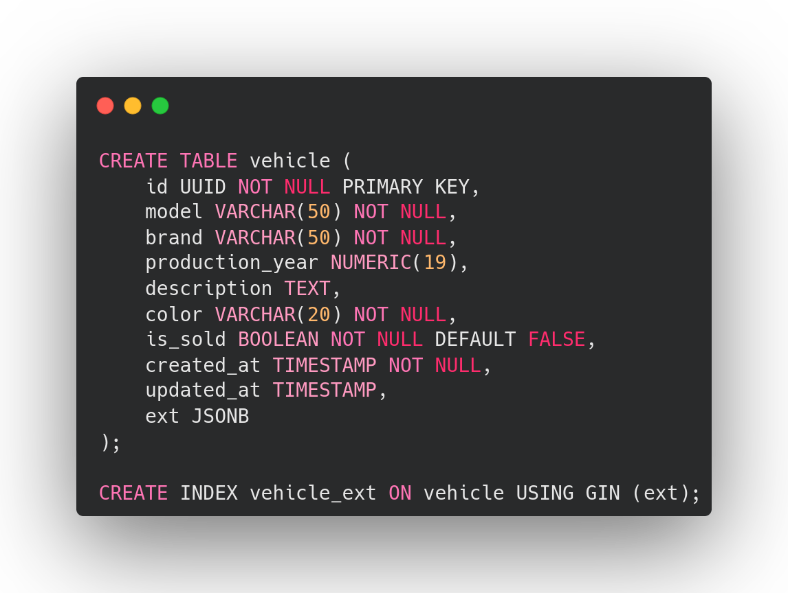
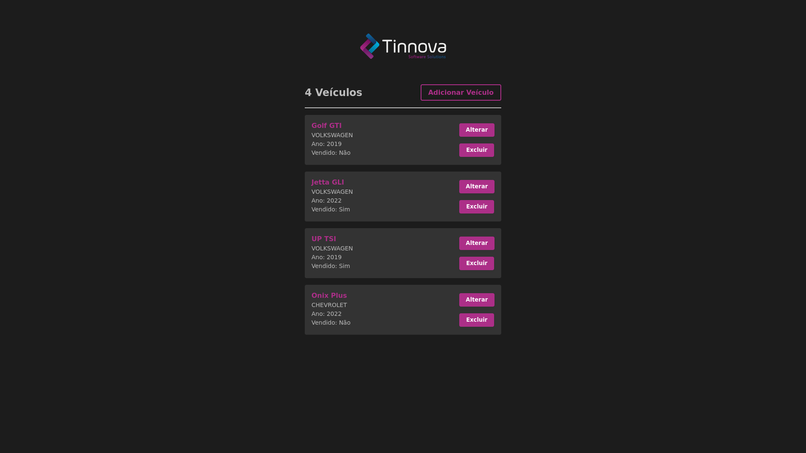

<h1 align="center">Vehicle Register</h1>

<h1 align="center"></h1>
<h1 align="center"></h1>

## ✨ Technologies

This project was developed using the following technologies:

- [Spring](https://spring.io/)
- [Hibernate](https://hibernate.org/)
- [Flyway](https://flywaydb.org/)
- [PostgreSQL](https://www.postgresql.org/)
- [QueryDSL](http://querydsl.com/)
- [JUnit](https://junit.org/junit5/)
- [Mockito](https://site.mockito.org/)
- [React](https://reactjs.org/)
- [Eslint](https://eslint.org/)
- [EditorConfig](https://editorconfig.org/)
- [Docker](https://www.docker.com/)
- [Docker-Compose](https://docs.docker.com/compose/)

## 💻 Project

Java Spring application which you can create, update, list and delete vehicles registers, also some extra features.

## 🔧 API Endpoints

```http
GET /veiculos
```
```http
GET /veiculos/filtro?marca={marca}&ano={ano}&cor={cor}
```
```http
GET /veiculos/{id}
```
```http
POST /veiculos
```
```http
PUT /veiculos/{id}
```
```http
PATCH /veiculos/{id}
```
```http
DELETE /veiculos/{id}
```
```http
GET /veiculos/disponiveis
```
```http
GET /veiculos/quantidade-por-decada?decada={decada}
```
```http
GET /veiculos/quantidade-por-marca?marca={marca}
```
```http
GET /veiculos/registros-da-semana
```

## 🤠 Documentation

- You will need to have Insomnia API client installed at your computer to use the JSON file and checkout the documentation.
You can download [here](https://insomnia.rest/download)

- The documentation of this project is available on file [insomnia](./api/insomnia/Insomnia_docs.yaml)


## 👷‍♀️ Tests Coverage

- Tests cover almost 100% of service lines.

## 🚀 Requirements

- You will need to have Node installed at your computer.
You can download [here](https://nodejs.org/en/)

- You will need to have some package manager installed at your computer too. (npm, yarn)

- You will need to have jdk17 and maven installed at your computer.

- You can download JDK [here](https://www.oracle.com/java/technologies/downloads/)

- You can download Maven [here](https://maven.apache.org/surefire/download.cgi)


## 🐳 How to run as a service with Docker

- You will need to have Docker installed at your computer and it need to be running.
You can download [here](https://docs.docker.com/desktop/windows/install/)

- Then open command line on the project folder.

```bash
# Run to start the docker's image build and container starting.
$ docker-compose up -d
```
- Await the process on the command line to end.

- Now the App it's available at `http://localhost:3000` and the API at `http://localhost:8080`.
